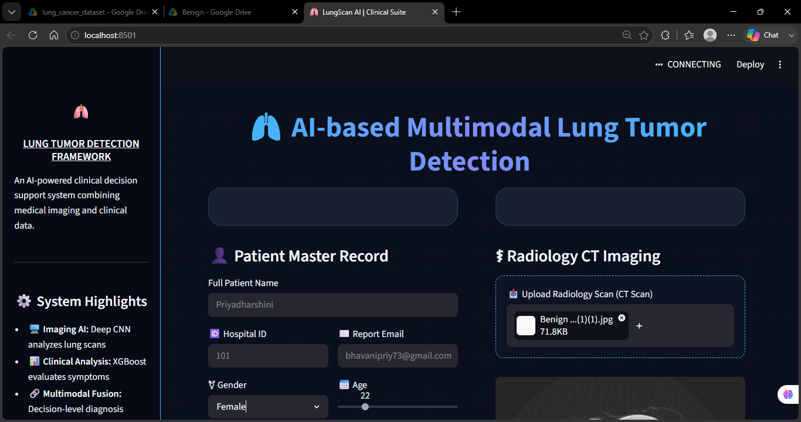
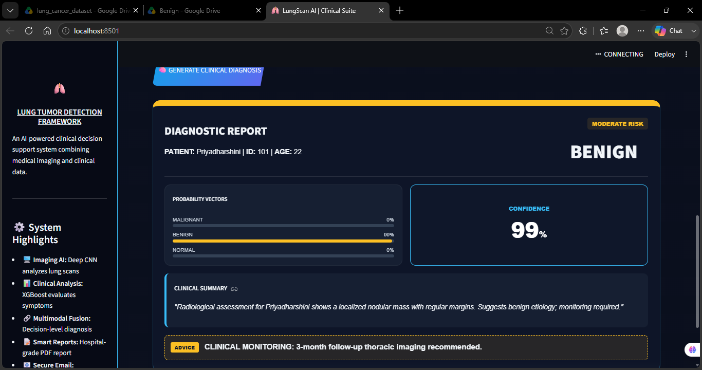

<div align="center">

# 🫁 LungScan AI — Multimodal Lung Tumor Detection

**An AI-powered clinical decision-support system combining medical imaging and clinical data analysis for lung tumor screening.**

[](https://www.python.org/)
[](https://streamlit.io/)
[](https://www.tensorflow.org/)
[](https://xgboost.readthedocs.io/)
[](#license)

[Overview](#-overview) •
[Features](#-features) •
[Demo](#-demo) •
[Architecture](#-architecture) •
[Installation](#-installation) •
[Usage](#-usage) •
[Disclaimer](#-disclaimer)

</div>

---

## 📖 Overview

**LungScan AI** is a multimodal clinical decision-support system that assists in the preliminary screening of lung tumors. It fuses two independent AI pipelines:

- 🖼️ A **Convolutional Neural Network (CNN)** that analyzes CT scan imagery to classify findings as **Benign**, **Malignant**, or **Normal**
- 📊 An **XGBoost classifier** that evaluates patient demographics and a 13-point clinical symptom checklist to estimate malignancy risk

The outputs of both models are combined through a **decision-level fusion layer** to produce a final diagnosis, a risk classification, and a clinical recommendation — all rendered in an interactive dashboard and exported as a hospital-grade PDF report.

---

## ✨ Features

- 🧠 **Dual-model AI fusion** — imaging + clinical data combined for a more robust prediction
- 📋 **Interactive patient intake form** with a 13-item symptom checklist
- 🩻 **CT scan upload and preview** directly in the browser
- 📊 **Real-time probability breakdown** across all three diagnostic classes
- 📝 **Auto-generated PDF diagnostic report** with patient details, scan image, and clinical summary
- 📧 **Automated secure email delivery** of the report to patient and clinical team
- 🎨 **Custom clinical-grade UI** built with Streamlit

---

## 🎬 Demo

<div align="center">

**Patient intake & CT scan upload**



**Generated diagnostic report**



</div>

---

## 🏗 Architecture

```
                ┌────────────────────┐
                │   Streamlit UI      │
                │ (patient intake +   │
                │   scan upload)      │
                └─────────┬───────────┘
                          │
          ┌───────────────┴────────────────┐
          ▼                                 ▼
┌─────────────────────┐         ┌──────────────────────┐
│   Imaging Branch      │         │   Clinical Branch      │
│  CNN (Lung_Tumor.h5)  │         │  XGBoost Classifier    │
│  → Benign/Malignant/  │         │  → Malignancy risk     │
│     Normal probs       │         │     probability         │
└──────────┬─────────────┘         └───────────┬─────────────┘
           │                                    │
           └────────────────┬───────────────────┘
                             ▼
                 ┌───────────────────────┐
                 │   Fusion Logic Layer    │
                 │  (rule-based decision)  │
                 └───────────┬─────────────┘
                             ▼
                 ┌───────────────────────┐
                 │  Diagnosis + Risk Tier  │
                 │  + PDF Report + Email   │
                 └───────────────────────┘
```

---

## 🛠 Tech Stack

| Layer | Technology |
|---|---|
| Frontend / UI | Streamlit (custom CSS theme) |
| Image Classification | TensorFlow / Keras CNN, OpenCV |
| Clinical Classification | XGBoost, scikit-learn |
| Report Generation | ReportLab (PDF) |
| Email Delivery | Python `smtplib` (Gmail SMTP-SSL) |
| Config Management | `python-dotenv` |

---

## ⚙️ Installation

> Requires **Python 3.10–3.13** (TensorFlow does not yet support 3.14+)

```bash
# 1. Clone the repo
git clone https://github.com/P2r0i0y0a4/LungCancerScan-AI.git
cd LungCancerScan-AI

# 2. Create and activate a virtual environment
python -m venv venv
venv\Scripts\activate        # Windows
# source venv/bin/activate   # macOS/Linux

# 3. Install dependencies
pip install -r requirements.txt

# 4. Configure environment variables
# Create a .env file in the project root:
#   EMAIL_SENDER
#   EMAIL_PASSWORD
#   DOCTOR_EMAIL

# 5. Run the app
streamlit run app.py
```

The app will open automatically at `http://localhost:8501`.

> 🔐 **Note:** `EMAIL_PASSWORD` must be a Gmail **App Password**, not your regular account password. Generate one under Google Account → Security → 2-Step Verification → App Passwords.

---

## 🚀 Usage

1. Fill in the **Patient Master Record** (name, hospital ID, email, age, gender)
2. Complete the **Clinical Symptom Checklist**
3. Upload a **CT scan** image (`.jpg` / `.png`)
4. Click **Generate Clinical Diagnosis**
5. Review the on-screen diagnostic report
6. If an email was provided, the PDF report is automatically sent to the patient and the clinical team

---

## 📁 Project Structure

```
LungCancerScan-AI/
├── app.py                      # Main Streamlit application
├── email_utils.py              # PDF generation + email delivery
├── requirements.txt            # Python dependencies
├── Lung_Tumor.h5                # Trained CNN model (imaging)
├── clinical_xgb_model.pkl       # Trained XGBoost model (clinical)
├── clinical_scaler.pkl          # Feature scaler for clinical model
├── clinical_label_encoder.pkl   # Label encoder for clinical features
├── .gitignore
└── README.md
```

---

## ⚠️ Disclaimer

This project is a **clinical decision-support prototype developed for academic purposes only**. It is **not a certified diagnostic medical device** and must not be used as a substitute for professional medical judgment. All predictions should be verified by a board-certified medical professional.

---

## 📄 License

This project was developed as part of an academic final-year project. Please contact the repository owner before reuse or redistribution.

---

<div align="center">

Made with ❤️ as a Final Year Engineering Project

</div>
